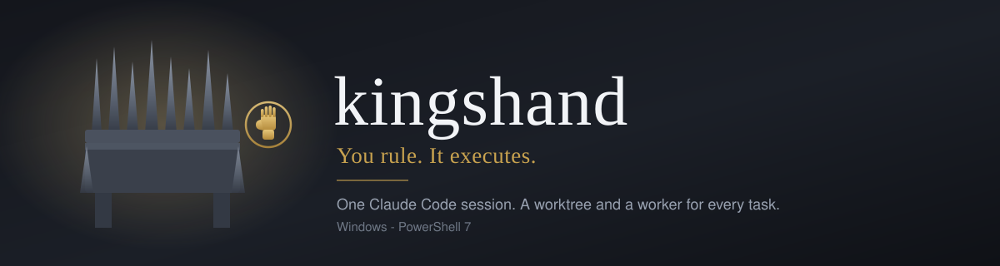

[](https://github.com/emgee-labs/kingshand)
[](https://github.com/PowerShell/PowerShell)
[](tests)
[](LICENSE)

# You rule. It executes.

You can run one Claude Code session easily. The trouble starts when you want three things happening
at once - a fix here, an investigation there, a flaky test somebody has to actually sit with. You
end up as a tab-juggler: three terminals, three sets of context in your head, and no idea which one
went quiet an hour ago because it is waiting on a question nobody is there to answer.

Kingshand makes one session the only one you talk to. You describe the work; it writes the brief,
waits for your word, puts a worker in its own git worktree, and comes back when there is something
for you to decide.

## The model

**You are the King.** You decide, you approve, and one current word from you outranks any standing
rule in this repository.

**The tool is the Hand.** It acts in your name, never in its own, and never does the project work
itself.

**Workers are the King's men.** Each is called up for one task in one worktree, and released when
it is done.

Those words are for you. They never appear in a commit, a pull request, or anything anyone else
reads.

## What it gives you

- **Parallel workers.** One background agent per unit of work, each isolated in its own git
  worktree, so three tickets can be in flight without treading on each other.
- **Two gates.** You approve what is dispatched, and you approve what lands. Per project, you can
  turn both off.
- **Per-project delivery posture.** A project is registered `local-only`, `direct-PR` or
  `no-mistakes`. Nothing is dispatched into a project that is not registered, and posture is read
  rather than inferred.
- **A durable queue.** Work items, dependencies and held decisions survive a restart, because a
  decision that lives only in the conversation is a decision you will lose.
- **A session-start digest.** The version you are on, registered projects, live workers, the queue,
  the index of everything the tool holds for you, your standing instructions and the curated
  memory, printed once at session open. A restart is meant to be a non-event.
- **A version, and one command to move it.** `/update` fast-forwards this installation to the
  latest tagged release, re-runs the installer, and tells you what you moved from, what you moved
  to, and what changed. It updates to a release rather than to whatever was pushed last, and it
  refuses outright while a worker is live or your tree is dirty.
- **Nothing settled goes unread.** Every durable file the tool keeps for you gets one line in an
  index, and every brief names the files its worker must read before it starts - so a decision you
  already made cannot sit in a file nobody opens while the work ships without it.
- **Replies are short by default, and what cannot be short gets rendered.** Next action first,
  numbered steps, lists capped at five, no preamble. Anything you have to decide on opens as a
  review surface in your browser rather than a wall of chat, because a choice buried in a paragraph
  is a choice you have to dig back out. Ask for the long version any time; `herald` owns the shape
  and is the switch.
- **Your preferences stay yours.** `instructions.md` is read every session and never written by the
  tool - enforced by the permission layer, not just asked for in prose.
- **Your other projects are untouched.** All fifteen skills live in this repository's own
  `.claude\skills\`. Nothing is written into `~\.claude\`, so a session anywhere else on the machine
  behaves exactly as it did before.

## Quick start

### Requirements

Six things, and the installer fetches or names every one of them.

| | Why | Install |
|---|---|---|
| PowerShell 7+ | every script targets it | `winget install --id Microsoft.PowerShell` |
| Claude Code | the Hand and every worker | `npm install -g @anthropic-ai/claude-code` |
| Git for Windows | worktrees are the isolation | `winget install --id Git.Git` |
| `lavish-axi` | the review surface both gates render to | `npm install -g lavish-axi` |
| `tasks-axi` | the durable backlog | `npm install -g tasks-axi` |
| `herdr` | the terminal every worker is spawned and watched through | fetched by the installer |

Everything below this line is optional, and a run with none of it installed reports no failure.

**The GitHub CLI, only for pull requests.** `gh` is needed by the push-capable postures -
`direct-PR`, `no-mistakes`, `no-mistakes-prod-only` - because those end at a pull request. Work
that stops at a finished local branch never calls it. `-InstallMissing` installs it anyway, and
its absence is a note rather than a failure; `/annex` refuses to register a push-capable posture
without it and tells you the command. `winget install --id GitHub.cli`, then `gh auth login`.

**The review gate.** `no-mistakes` is needed only by projects you register `no-mistakes` or
`no-mistakes-prod-only`. `setup` asks whether you want it, and `.\install.ps1 -WithReviewGate`
adds it at any time - it fetches the Windows build from
[kunchenguid/no-mistakes](https://github.com/kunchenguid/no-mistakes) and checks it against the
published SHA-256 before extracting. Work that stops at a finished local branch never needs it.

> Do not run `npm install -g no-mistakes`. That name on npm belongs to a **different, unrelated
> tool**. It installs cleanly and then does not work, which is a slow way to find out.

**Azure DevOps, only if you work ADO tickets.** Kingshand can read a work item and its comments
straight into a brief, which needs the `ado-local-mcp` server configured in Claude Code plus an
organization and a token. Nothing here installs it and nothing here needs it. With it absent, the
Hand says so once and asks you to paste the ticket or describe the work, and handles it as adhoc -
which is the ordinary path and works exactly as well.

**Pester 6+, only to run this repository's own tests.** Nothing in `bin\` and no skill imports it,
so an installation without Pester dispatches, gates and lands identically. `Install-Module Pester
-MinimumVersion 6.0.0 -Force -SkipPublisherCheck -Scope CurrentUser`, or let `-InstallMissing`
do it.

The installer adds `.claude/worktrees/` and `.claude/settings.local.json` to your global gitignore.
Workers live inside your own repositories and would otherwise show up there as untracked changes,
and the permission grant written into each worker's own tree would leave that tree dirty before it
starts - which the review gate refuses to run in. It appends those two lines to the file
`git config --global core.excludesFile` names, creating that file and pointing the config at it
when the config is unset, and it never writes either line twice.

### Install and launch

Clone it wherever you keep things. Any drive, any folder, spaces in the path are fine - it works
out its own location and nothing here assumes otherwise.

```powershell
git clone https://github.com/emgee-labs/kingshand
cd kingshand
claude
```

Then type **`set it up`** - or `setup`, or `/setup`. Every skill ships inside the repository, so
they are readable in a fresh clone with nothing installed yet. The installer names what it found,
what it installed, and what still needs you.

The manual equivalent:

```powershell
.\install.ps1 -InstallMissing
```

**`-InstallMissing` is opt-in.** Without it, nothing is installed and each missing tool is reported
with the exact command that fixes it. Nothing self-elevates. `herdr` is the one thing fetched
directly: it is checked against the SHA-256 published in `https://herdr.dev/latest.json` before it
is extracted, a mismatch deletes the download and installs nothing, and an offline machine is told
so in one line rather than shown a web exception. Open a new shell afterwards so `KINGSHAND_HOME`
is picked up.

### Talk to it

```powershell
cd kingshand
claude
```

The screen will be empty. That is normal and not a failed install: the session-start digest is
handed to the Hand as context rather than printed, and Claude Code says nothing until you do. Say
anything - `hello` will do - and the first reply opens by telling you where things stand.

1. **Write your standing instructions** in `instructions.md` - how you want to be addressed, your
   delivery defaults, your conventions. Read every session, never written to, gitignored.
2. **Register a repository.** `/annex D:\code\your-repo` - any path on any drive. It records the
   posture and never clones.
3. **Give it work.** *"fix the flaky login test in your-repo"*. You get a brief to approve before
   anything is dispatched.
4. **Check in.** `/survey` for where everything stands, `/audience` for what you missed.
5. **Keep memory current.** `/chronicle` before a context reset.

## How it works

```
   you
    |  describe the work
    v
  the Hand  ---- writes a brief, waits for your word
    |
    |  git worktree add + settings + folder trust
    v
  herdr pane ---- a real terminal it owns
    |
    v
  worker (Claude Code)  ->  <repo>\.claude\worktrees\<ticket>
    |
    |  the Hand watches the screen, not just a status word
    v
  report.md  ->  the landing gate  ->  your approval
```

Every worker is an ordinary interactive Claude Code session in a terminal herdr owns. That is what
makes it possible to read a worker's state while it runs, and to send text into one that has gone
astray - neither of which a detached background session allows.

## Built-in skills

Fifteen, all project-local. Ten you invoke; five the Hand loads for itself.

| Skill | What it is for |
|---|---|
| `setup` | Install and configure kingshand on this machine |
| `update` | Move this installation to the latest release, and say what changed |
| `annex` | Register a repository and its delivery posture. Never clones |
| `muster` | Dispatch and supervise workers across tickets and repos |
| `survey` | Where everything stands - the catch-up digest |
| `herald` | Owns reply shape, which is on by default. Load it to turn it off |
| `regency` | Hold the fleet while you are away, and batch what does not need you. Also `/afk` |
| `audience` | What happened while you were away from this session |
| `chronicle` | Curate durable memory before a context reset |
| `counsel` | Break a story or a whole feature into work, and find where the stories overlap |
| `rally` | A worker that has stopped making progress |
| `decree` | Finishing an investigation without losing a decision that is yours |
| `inquest` | Diagnosing a reported bug before writing its brief |
| `petition` | Deciding an ask-user finding from the review gate |
| `statute` | Changing kingshand's own tracked material |

## Permissions, and what you are agreeing to

`.claude\settings.json` ships with `defaultMode: bypassPermissions`, and every worker gets the same
grant written into its own worktree before it starts. **Neither the Hand nor its workers will ask
you to approve a tool call.** That is deliberate - the Hand reads diffs, runs git and merges locally
hundreds of times in a session - but it is a real decision, and better made knowingly now than
discovered later.

What still constrains it:

- Workers only ever run inside their own git worktree, never in your checkout.
- Each worktree is recorded as trusted in your own `~\.claude.json` before its worker starts, so an
  unattended worker does not stop on Claude Code's folder-trust dialog with nobody there to answer.
  That entry is exactly the worktree kingshand just created - never its parent repository, and never
  the machine. With no `~\.claude.json`, nothing is written and the worker stops at the dialog.
- Nothing is dispatched into a repository you have not registered.
- Nothing pushes unless that project is registered with a push-capable posture, and nothing is
  merged on the forge at all.
- `deny` blocks reads of `~\.ssh`, AWS credentials and `config\credentials\`, and blocks edits to
  `instructions.md` - your standing instructions are protected by the permission layer, not just by
  prose asking nicely.

If you would rather approve each call, remove `defaultMode` from `.claude\settings.json`. Expect a
great many prompts.

## Layout

```
CLAUDE.md               the Hand's always-loaded instructions - identity, hard rules, contracts
VERSION                 this installation's version, and the only place it is written down
bin\                    dispatch, worker state, registry, snapshot, digest, herdr, workspace prep,
                        version and self-update
.claude\skills\         fifteen project-local skills. They load only in this directory
tests\                  the Pester suite
tools\herdr\            herdr, fetched and SHA-256 verified by the installer - gitignored,
                        and deliberately not on PATH
docs\                   the architecture decisions worth keeping
.no-mistakes.yaml       the branch kingshand's own work integrates into - dev, which every pull
                        request targets and every worker branches from, deliberately not the
                        branch a fresh clone lands on
instructions.example.md the template install.ps1 copies to instructions.md
install.ps1             prerequisites and config - writes at most four things outside this
                        repository: KINGSHAND_HOME, LAVISH_AXI_PORT, two lines in your global
                        gitignore, and claude.exe ahead of npm's wrapper on PATH when your
                        machine only has the wrapper
```

Everything a run produces - `data\`, `state\`, `config\`, `tools\` and `instructions.md` - is
gitignored. That is not tidiness. It is the difference between publishing this tool and publishing
your own project registry.

## Tests

```powershell
Invoke-Pester -Path .\tests
```

`tasks-axi` must be on PATH or the backlog cases skip with a reason. Nothing else in the suite has
an external dependency, and nothing in it reads or writes your live `data\` or `state\`.

## Credit

Kingshand is a Windows-native rebuild of ideas from
[firstmate](https://github.com/kunchenguid/firstmate) by Kun Chen, which runs on macOS and Linux.
Several skills, the delivery-posture and knowledge-routing contracts, the registry line format and
the startup-memory estimate all come from there. Where a rule here reads well, it is usually because
it was proven there first.

What differs is the layer underneath. Firstmate supervises workers itself, across six terminal
backends and roughly 56,000 lines of shell. Kingshand keeps about 1,200 lines of PowerShell over a
single terminal runtime, which is why it runs on Windows at all - and why it cannot do some of what
firstmate does. `docs\` records that trade and what would reverse it.

## Licence

MIT. See `LICENSE`, which also carries firstmate's copyright notice for the portions derived from
it.